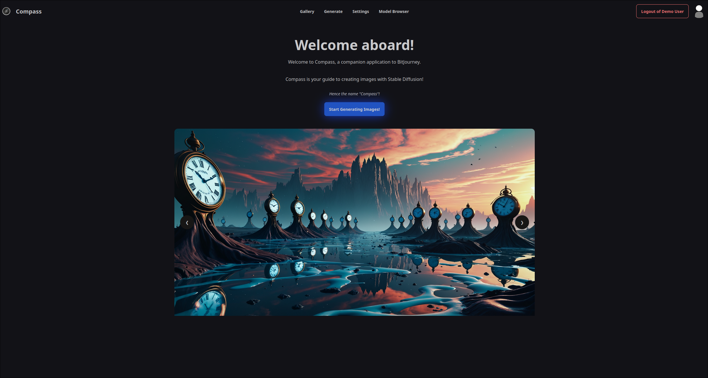

# Compass

### What's a Compass?

Glad you asked! A compass is a navigational tool that helps... Ah wait, no, you probably already know what a compass is.
You probably meant what is *this* "Compass"? That makes more sense and is a valid question too!

Compass is part of the BitJourney stack and is a downstream client for [Navigator](https://github.com/BitForged/Navigator).
When combined with the rest of the BitJourney stack, Compass allows users to generate images via Stable Diffusion!

A picture is worth a thousand words, so before any further explanation let me show what Compass looks like!

### Screenshots




### Disclaimer

Compass, along with the rest of the BitJourney stack, is built with assumptions of my own use-cases and environment in mind.

In a way, this will always influence how Compass is built, though I would also like to make it more "generalized" where I can.

For example, at some point I'd like to create a better landing page for Compass—perhaps with a carousel of (static) example images created with Stable Diffusion. Bonus points if this were configurable by the operator!

### Requirements

Compass is a downstream client for Navigator, which acts as a coordinator for generating images with Stable Diffusion. Navigator is the "brain" and Compass cannot work without it.

- With the above said, you'll need [an instance of Navigator](https://github.com/BitForged/Navigator)
  - Your instance of Navigator does not need to be publicly routable, but if it is not, then the "Share to Civitai" shortcut will not work since Civitai's post intent feature pulls from public image links
    - Said feature is fully optional, of course, and has no visible UI elements unless enabled in the settings menu
- A Web Server to host Compass on
  - If you *really* do not have any desire to set up a web server, you could also follow the "development" instructions below which will spawn an embedded web server
  - HTTPs/TLS is not required for most of Compass' features, though if you run an instance over the public internet, it is highly recommended (and *is* required for Progressive Web App functionality)

### Design Goals, Origins, and Aspirations

(If these details aren't really your thing, feel free to skip to the installation instructions below this section—though I do think it's worth a reading if you have some time!)

#### Design Goals

Well, the entire philosophy behind the creation of the BitJourney stack was to make it easier for a few friends of mine
to try out image generation via Stable Diffusion.

Most of the existing tooling around Stable Diffusion is quite advanced—which is good!
That is because Stable Diffusion is an incredibly powerful tool and an ecosystem that is constantly changing.

This does mean, though, that getting into Stable Diffusion is quite a daunting task and can turn a lot of people off from trying it, which is
unfortunate given how much potential it has.

I also want Compass to be flexible enough to work for intermediate level users like myself, however. I do not think that Compass
will ever be able to replace a full-blown ComfyUI workflow that has custom nodes to create the pixel-perfect image. But I like to think it still
has a place between that and something that only allows you to enter a prompt.

Effectively, my design goal for Compass is to act as a bridge between beginner and intermediate usage of Stable Diffusion.
In an ideal world, I'd like for someone who is new to Stable Diffusion to be able to get started using Compass, then learn how to use some of the more advanced features.

Then eventually they could "graduate" from Compass and move on to something like ComfyUI while also keeping Compass around for simpler tasks.

#### Origins

Let's talk origin stories! Compass is not the first Navigator-compatible client, that honor belongs to the BitJourney Discord plugin.
The bot started out from the natural progression of the fact that I wanted an easier way to use [Forge](https://github.com/lllyasviel/stable-diffusion-webui-forge/) when away from my PC, while also allowing a few friends to try it out.

In fact, the plugin was originally prototyped *before* Navigator existed entirely, until I decided it would be better to abstract direct Forge API and image handling into its own service.

Since my friends and I all communicate through Discord, having a bot that could exist in our conversations that anyone could quickly invoke to create an image made sense.

Unfortunately, I very quickly discovered that Discord bots have quite a few limitations when they're not very simple, especially when it comes to their UX design.
Discord at its heart is a text-based communication platform, even if it does try to hide this fact by blurring the lines a bit.

As I started wanting to expose more of the parameters and features that Stable Diffusion/Forge offers for the intermediate user, I realized that a text-based platform was probably not the best choice.
Some of the features that Compass has today would be impossible or extremely challenging/impractical with Discord, such as the LoRA selector.

Thus, the next cross-platform choice was naturally a web application, and Compass was born. Now, Compass is the primary downstream client in the BitJourney stack, although we also keep the original bot plugin around for quick one-off generations.

#### Aspirations

I suppose the design goals and origin story behind Compass do a fairly good job at describing the aspirations, but aside from what was mentioned there, I did have one other reason for creating Compass.
I wanted more experience with developing web-based applications. While I've created smaller web apps in the past, I had never used Tailwind CSS (which still seems to be the "hotness" in the web development ecosystem).

Additionally, I wanted to have more hands-on experience with Vue.js. There are tons of SPA frameworks for the web, and while Vue is not perfect, it does still work out pretty well most of the time and has a thriving ecosystem around it.

(Though I particularly liked the old versions of Angular—even if that is due to rose-colored glasses)

### Installation Instructions

Setting up Compass is fairly straight forward, since it is a web application, it just needs to be deployed to a web server. Before building, please be sure to copy the `.env.example` file to `.env` and update the values there:

```shell
cp .env.example .env
```

Here's a quick reference of what each environmental variable does:

- `VITE_API_BASE`: Tells Compass what the HTTP(s) base URL for [Navigator](https://github.com/BitForged/Navigator) should be
- `VITE_RT_API_BASE`: Tells Compass what the WebSocket base URL for [Navigator](https://github.com/BitForged/Navigator) should be
- `VITE_BASE_URL`: Tells Compass what its own base URL should be (used to initialize internal routing)
- `VITE_DISCORD_CLIENT_ID`: Specifies the Client ID to use during the Discord OAuth process
- `VITE_DISCORD_REDIRECT_URI`: This generally should be the same as `VITE_BASE_URL`

You can build Compass by running the following in the directory you've cloned the source to:

```shell
npm install --include=dev
npm run build
```

(To develop Compass locally, you can switch out `npm run build` with `npm run dev` and Vite will start a hot-reloadable web server for you)

This should create a `dist` folder that contains the compiled assets for Compass, then deploy these to your web server. You'll likely want to make sure it gets deployed to the root directory, rather than a subfolder.

There is an example Nginx config provided in the `examples` folder. You should replace `/var/www/your_compass_directory` with the directory Compass' files are at, along with the `port`.

This config assumes that you are going to reverse proxy from a different web server (or just a different Nginx config). It should be adjustable to use HTTPs, and a utility like Certbot can likely do it for you automatically.

Alternatively, you can also use the included docker files from the `docker` folder to setup Compass. Make sure to edit the `./docker/compass/compass_env` file using the guidelines from above before building the container, however.

```shell
docker compose build compass
docker compose up -d compass
```

(Note that if you change any of the variables in `compass_env`, you need to rebuild the container with `docker compose build --no-cache compass`)

This should start Compass on port `8888`, bound to localhost. From there, you can either reverse proxy it using your favorite web server or connect to it locally. A reverse proxy is recommended for public usage, but otherwise just remove `127.0.0.1:` from the port binding in `compose.yaml`.

**Note** that Compass can also act as a Progressive Web Application, but this relies on Service Workers which can only be served and used over HTTPs/TLS. You can run Compass without TLS, but the PWA functionality will not work in this case.

Afterward, so long as you have followed the [setup instructions for Navigator](https://github.com/BitForged/Navigator) and set up the environmental variables correctly, you should be able to log in and get started.

If you receive an error while trying to log into Compass with your Discord account, ensure that you have authorized your account as per Navigator's instructions.